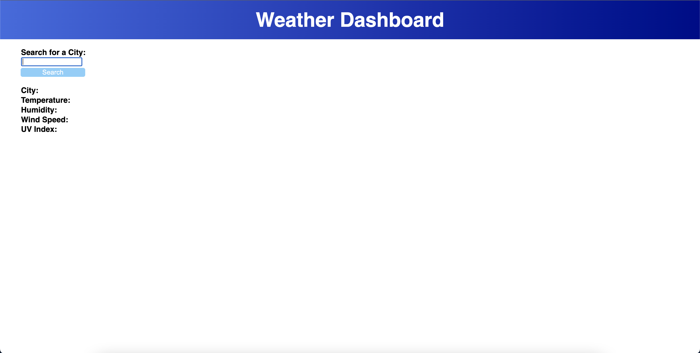

# weather-report

This project was designed so that a user can enter any city in the world and obtain that cities current weather conditions.  The deployed site has useful real world applications for travelers and HTML, CSS and Javscript play their respective roles in making this application come to life.  This project helped illustrate the power of being able to utilize APIs in development.  Below you will find a link to my deployed page along with a screenshot.

[https://jakewmcmillan.github.io/weather-report/](https://jakewmcmillan.github.io/weather-report/)

